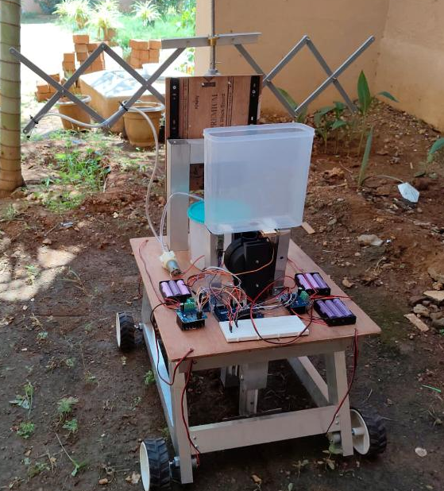

# 🌾 Multipurpose Agri-Bot

A modular, Bluetooth-controlled agricultural robot built on an **Arduino Mega 2560**. Designed and fabricated as a 4-wheel skid-steer platform that combines mobility with three interchangeable field operations — grass cutting, water pumping, and a lead-screw actuator for mechanical stretch/retract tasks — aimed at reducing manual labour in small-scale farming.



## Overview

The Agri-Bot is a ground-up mechatronics build: chassis fabrication, motor/driver selection, power distribution, and embedded control, all done independently. It's controlled wirelessly over Bluetooth using a joystick-style interface for movement and dedicated commands for implement control.

**Key result:** reduced manual labour by ~60% during prototype field testing (ploughing/irrigation-prep tasks timed against manual work).

## Features

- 🚗 **4-wheel skid-steer drive** — independent left/right motor pairing for tank-style turning
- ✂️ **Cutter motor** — for grass/vegetation clearing
- 💧 **Water pump** — for irrigation
- 🔩 **Lead screw mechanism** — motorized extend/retract for soil prep / attachment positioning
- 📶 **Bluetooth wireless control** (HC-05) — joystick for driving, dedicated buttons for implements
- ⚙️ **High-current motor drivers (BTS7960)** — one pair per wheel side, one shared driver relay-switched across the three implements
- 🛑 **Connection failsafe** — motors auto-stop if the Bluetooth link drops

## Hardware

| Component | Qty | Purpose |
|---|---|---|
| Arduino Mega 2560 | 1 | Main controller |
| BTS7960 motor driver | 3 | 2x wheel pairs + 1x shared implement driver |
| HC-05 Bluetooth module | 1 | Wireless control link (on `Serial1`) |
| 3-channel relay module | 1 | Selects which implement is connected to the shared driver |
| DC gear motors (wheels) | 4 | Drive, wired as left pair / right pair |
| DC motor (cutter) | 1 | Grass cutting attachment |
| DC motor (pump) | 1 | Water pump |
| DC motor (lead screw) | 1 | Linear extend/retract actuator |
| Li-ion battery packs | 2 | Power supply |
| Chassis (fabricated) | 1 | Modeled in Fusion 360, built in-house |

## Wiring / Pin Map

| Signal | Mega Pin | Notes |
|---|---|---|
| HC-05 RX/TX | `Serial1` (18/19) | HC-05 RX needs a voltage divider (3.3V logic) |
| Left driver RPWM / LPWM / EN | 2 / 3 / 22 | Drives left wheel pair |
| Right driver RPWM / LPWM / EN | 4 / 5 / 23 | Drives right wheel pair |
| Aux driver RPWM / LPWM / EN | 6 / 7 / 24 | Shared across cutter/pump/lead screw |
| Relay — Cutter | 26 | Active-LOW relay module |
| Relay — Pump | 27 | Active-LOW relay module |
| Relay — Lead screw | 28 | Active-LOW relay module |

> The shared aux BTS7960 drives whichever implement's relay is closed — only one relay is ever active at a time, so cutter, pump, and lead screw never run simultaneously.

## Control Scheme

Controlled via the **[Arduino Bluetooth Controller](https://play.google.com/store/apps/details?id=braulio.calle.bluetoothRCcontroller)** app (Broxcode) over the HC-05 link.

**Joystick (movement):**

| Command | Action |
|---|---|
| `F` / `B` | Forward / Backward |
| `L` / `R` | Spin left / right |
| `G` / `I` / `H` / `J` | Diagonal forward-left / forward-right / back-left / back-right |
| `S` | Stop |

**Buttons (implements):**

| Button | Press sends | Release sends | Action |
|---|---|---|---|
| 1 | `1` | — | Toggle cutter on/off |
| 2 | `2` | — | Toggle pump on/off |
| 3 | `3` | `e` | Lead screw extend (momentary — runs while held) |
| 4 | `4` | `r` | Lead screw retract (momentary — runs while held) |

## Design

The chassis and mounting brackets were modeled in **Fusion 360** before fabrication, allowing the layout (battery placement, driver mounting, water tank position, lead-screw travel) to be validated before building.

## Repository Structure

```
Agri-Bot/
├── src/
│   └── AgriBot_Mega2560.ino   # Main firmware
├── images/
│   └── agribot_photo.png      # Build photo
├── docs/
│   └── wiring_notes.md        # Extra wiring/build notes
└── README.md
```

## Getting Started

1. Wire the components per the pin map above.
2. Open `src/AgriBot_Mega2560.ino` in the Arduino IDE.
3. Select **Board → Arduino Mega or Mega 2560** and the correct COM port.
4. Upload the sketch.
5. Pair your phone with the HC-05 (default PIN usually `1234` or `0000`).
6. Open the Arduino Bluetooth Controller app, configure the buttons as above, connect, and drive.

## Future Improvements

- [ ] Add limit switches on the lead screw to auto-stop at full extend/retract
- [ ] Replace app-based control with a custom mobile app / web dashboard
- [ ] Add current sensing on the BTS7960 modules for stall/overload protection
- [ ] Onboard soil-moisture or camera-based autonomy for reduced manual driving

## Author

Built independently — mechanical design, fabrication, and embedded firmware.

## License

This project is licensed under the MIT License — see [LICENSE](LICENSE) for details.
